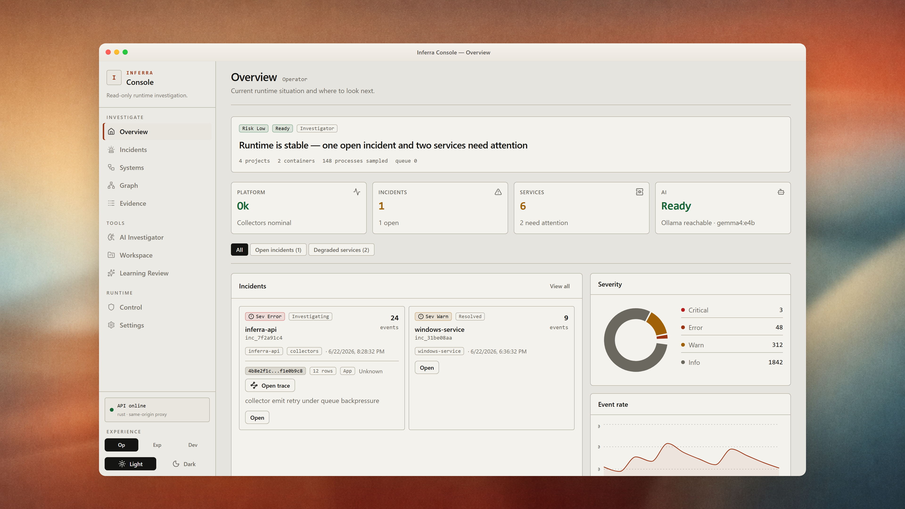

<p align="center">
  
</p>

<h1 align="center">Inferra</h1>

<p align="center">
  <strong>Local-first runtime intelligence — observe, investigate, and explain without touching production.</strong>
</p>

<p align="center">
  <a href="https://github.com/Dev4YM/Inferra"></a>
  <a href="LICENSE"></a>
  <a href="VERSION"></a>
  <a href="https://github.com/Dev4YM/Inferra/actions"></a>
  <a href="docs/operations/install.md"></a>
</p>

<p align="center">
  <a href="#quick-start">Quick start</a> ·
  <a href="#features">Features</a> ·
  <a href="docs/">Documentation</a> ·
  <a href="CONTRIBUTING.md">Contributing</a> ·
  <a href="CHANGELOG.md">Changelog</a>
</p>

---

**Inferra** is an open-source, read-only control plane for the software you run locally. It ingests operational signals into SQLite, ranks incidents with deterministic rules, and presents evidence in a React console — with optional **local Ollama** explanations. No cloud backend required. No auto-remediation.

| Inferra **is** | Inferra **is not** |
| --- | --- |
| A local observer, researcher, and investigator | An auto-remediation or remote-control tool |
| Deterministic scoring + auditable state, with optional AI narration | A black-box “root cause AI” that rewrites scores |
| Rust runtime + SQLite + loopback web UI | A mandatory SaaS observability suite |

The screenshot above is a **real render** of the Overview page using the same React components and design tokens as the shipping UI. The committed asset lives at [`docs/assets/readme-hero.png`](docs/assets/readme-hero.png).

## Features

| Area | What you get |
| --- | --- |
| **Overview** | Risk headline, platform health, collector fleet, severity charts, incidents & services |
| **Incidents** | Clustered issues, cited evidence, investigation workflow, operator feedback |
| **Systems** | Runtime inventory, service health, deep links into workspace apps |
| **Evidence** | Searchable event stream, FTS, filters, Windows-service noise controls |
| **AI Investigator** | Scoped questions, SSE streaming, saved generations, `monitor_seconds` sampling |
| **Workspace** | Project discovery, running apps, per-app logs/resources, service mappings |
| **Control** | Collector lifecycle, config presets, AI doctor, diagnostics |

**Collectors** cover Windows Event Log, Windows services, host/process thresholds, syslog, journald, file tailing, Docker Engine, Kubernetes, and HTTP app ingest.

**Install anywhere:** Windows service, systemd, Docker/Compose, Helm, macOS LaunchDaemon. See [install guide](docs/operations/install.md).

## Quick start

### Windows

```powershell
git clone https://github.com/Dev4YM/Inferra.git
cd Inferra
.\scripts\install-inferra.ps1 -Full
```

Open **http://127.0.0.1:7433** (or your configured port).

### From source

```bash
git clone https://github.com/Dev4YM/Inferra.git
cd Inferra

cargo build --manifest-path src/Cargo.toml -p inferra-cli --release
./src/target/release/inferra --config inferra.toml setup --yes
./src/target/release/inferra --config inferra.toml init-db
./src/target/release/inferra --config inferra.toml serve
```

Build the UI bundle: `cd src/web/frontend && npm ci && npm run build`

## Open source

Inferra is **Apache-2.0** licensed. We welcome issues, documentation improvements, and pull requests.

| Resource | Link |
| --- | --- |
| **Repository** | [github.com/Dev4YM/Inferra](https://github.com/Dev4YM/Inferra) |
| **Contributing** | [CONTRIBUTING.md](CONTRIBUTING.md) |
| **Versioning** | [docs/operations/versioning.md](docs/operations/versioning.md) |
| **Security** | [docs/security/threat_model.md](docs/security/threat_model.md) |
| **Releases** | [CHANGELOG.md](CHANGELOG.md) · tag `v*` for signed artifacts |

**Report a bug** — [open an issue](https://github.com/Dev4YM/Inferra/issues/new) with OS, Inferra version (`inferra --version`), and steps to reproduce.

**Ship a fix** — fork, branch from `main`, keep PRs focused, and ensure CI passes (`cargo test`, `npm run build`, `python scripts/version.py verify`).

Maintainers can regenerate `docs/assets/readme-hero.png` locally with the gitignored tooling under `mock/readme-hero/` (not published in the repository).

## AI (optional)

AI is disabled by default. Enable local Ollama in `inferra.toml` — see [AI provider guide](docs/operations/ai_provider.md).

```bash
curl http://127.0.0.1:7433/api/ai/status
```

Investigations cite evidence, express uncertainty, and fall back to deterministic templates when the provider is unavailable.

## Architecture

```text
React console (src/web/frontend)
        │  /api/*
inferra-cli + inferra-api (Rust)
        │
SQLite (events.db, incidents.db) — local data dir only
```

Rust workspace: [`src/Cargo.toml`](src/Cargo.toml) · UI source: [`src/web/frontend`](src/web/frontend)

## Documentation

- **Operators:** [Install](docs/operations/install.md) · [Upgrade](docs/operations/upgrade.md) · [Troubleshooting](docs/operations/troubleshooting.md) · [Collectors](docs/operations/collectors.md)
- **Security:** [Threat model](docs/security/threat_model.md)

```bash
python -m pip install -e ".[docs]"
mkdocs serve
```

## Development

```bash
cargo test --manifest-path src/Cargo.toml --workspace
cd src/web/frontend && npm run build
python scripts/version.py verify
python -m pytest -q tests/unit/test_rust_packaging_contracts.py
```

## Non-goals

- No autonomous remediation
- No required cloud dependency
- No replacement for full multi-tenant observability platforms
- No AI mutation of deterministic scores or evidence

---

<p align="center">
  <sub>Open source under <a href="LICENSE">Apache-2.0</a> · Built for operators who want answers on their own machine.</sub>
</p>
